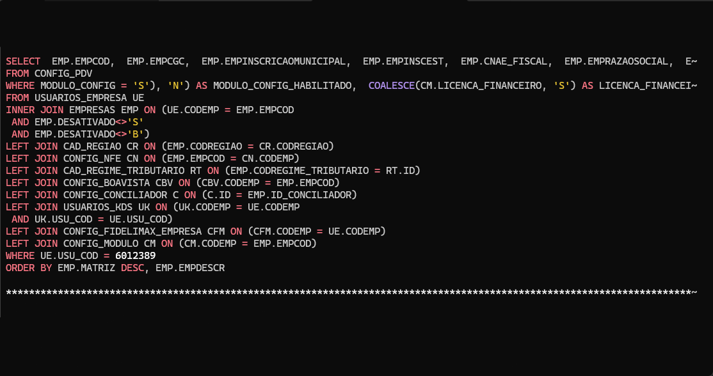
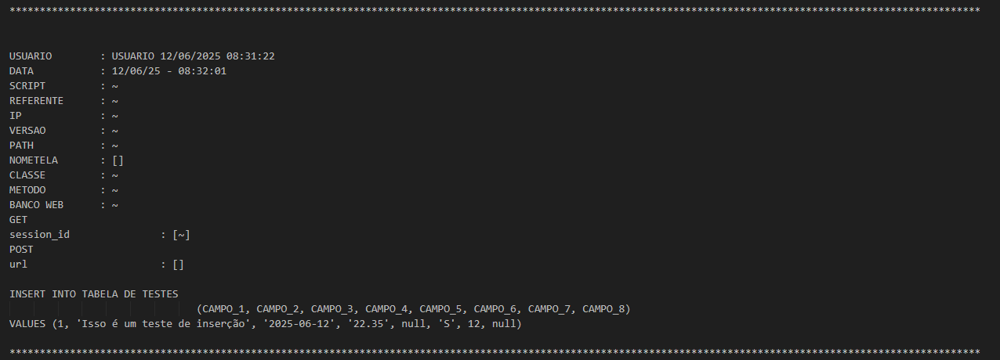

# CLI de Logs 3LM Informática

CLI para visualização e consulta dos logs de SQL da empresa
com recurso de paginação e atalhos de acesso para inicio e fim do log



## Bibliotecas

- [chalk](https://github.com/chalk/chalk#readme)
- [dotenv](https://www.npmjs.com/package/dotenv)
- [highlight.js](https://highlightjs.org/)
- [loading-cli](https://www.npmjs.com/package/loading-cli)
- [n-readlines](https://www.npmjs.com/package/n-readlines)
- [yargs](https://yargs.js.org/)


## Início Rápido

Altere o arquivo .env.example para .env e preencha os dados
|  Variável  |    Valor     |
|------------|--------------|
|  USER      |  Meu Usuário |
|  LOG_PATH  |  \\IP\log    |

Modelo de log base para o highlight.js


```bash
# Instalação de dependências
yarn

# rodando o projeto
node bin/index.js
```

## Instação no path

```bash
# Adiciona o projeto como um pacote global
yarn add -g .

# Para testar o funcionamento
log
```

### Caso o comando acima não funcione

Windows
```pwsh
# Powershell
new-item -itemtype SymbolicLink -Path "C:\Program Files\nodejs\node_modules\pretty-log" -Target "C:\Users\${user}\pretty-log"
```

```cmd
@REM cmd
mklink /d C:\Users\${user}\pretty-log C:\Program Files\nodejs\node_modules\pretty-log
```

Copie os arquivos da pasta `files` e cole dentro de `C:\Program Files\nodejs`